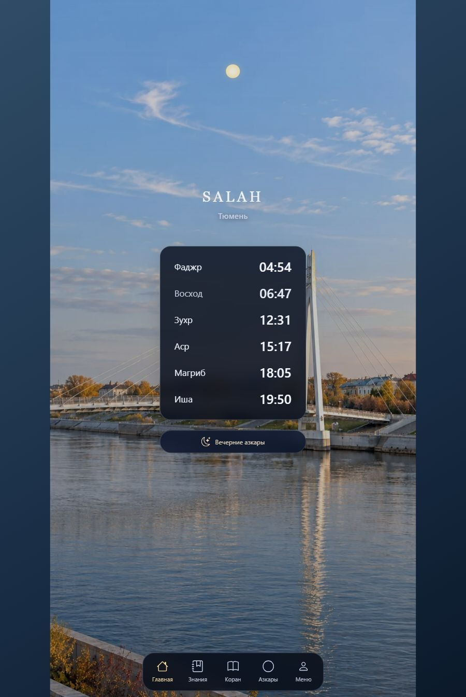
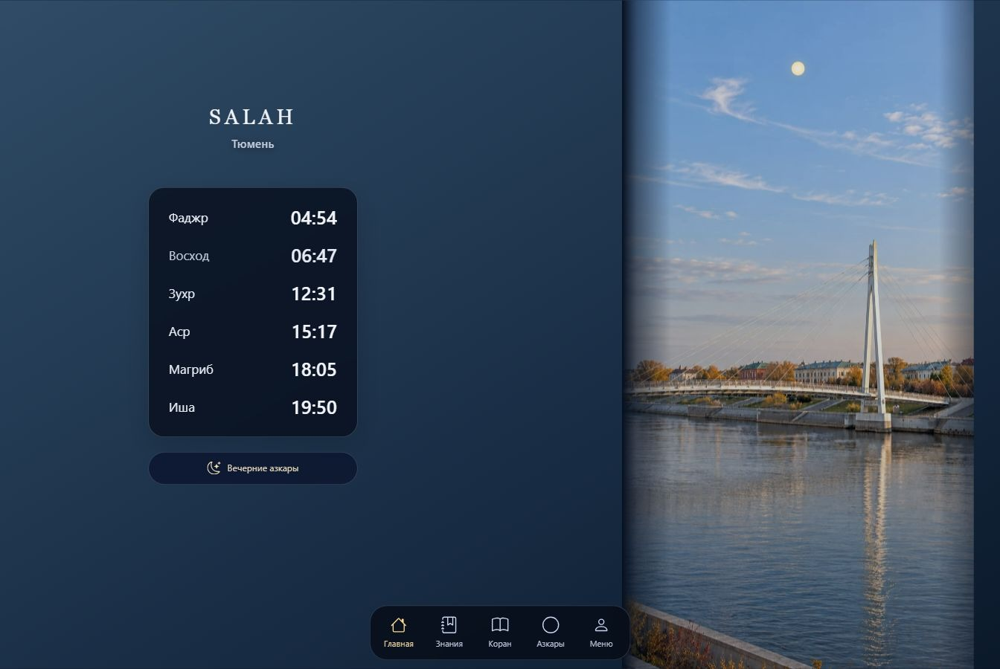

# Tablet wallpaper composition

SALAH keeps its existing phone composition when the shorter viewport dimension is below 600 CSS pixels. Installed tablet web apps no longer request the phone portrait lock. The Capacitor app ID, widgets and native code are unchanged.

For tablets, `wallpaper-layout.js` computes one uniform image scale and source rectangle. The day and night photographs, sky mask, celestial plane and weather layer share those coordinates. Resizing is coalesced into one animation frame; unchanged geometry causes no repeated style writes. The New York window mask still excludes the apartment floor.

The wide mosque artwork fills both orientations, with the dome and minarets kept in the visible right-hand area. City landmarks and New York currently use portrait artwork (853 × 1844; Khujand 851 × 1847). Their crop is bounded to 12% per dimension. A wide tablet displays that narrow image beside the timetable, with a quiet background filling the unused space. It does not enlarge a portrait source until most of the landmark disappears.

## Horizontal artwork still needed

A full-width horizontal landmark scene needs a separate landscape asset set for each city and New York: aligned day and night photographs, a sky mask drawn against the same composition, and—for New York—a corresponding window/weather mask. All files in a set should have identical dimensions and landmarks in identical positions. Adding a wide photograph alone would misalign the existing portrait masks. No new horizontal photographs are included in this change.

## Verification, 4 October 2026

Browser previews use 900 × 1344 and 1344 × 900 CSS pixels. Rotation, Tyumen day/night, rain, New York floor clipping and the mosque composition were inspected. Day/night/sky/weather bounding rectangles match. The 390 × 844 phone layer geometry and mask settings match the main baseline (255dcf7e). Automated geometry checks also cover 600 × 960, 1024 × 1366, 1366 × 1024, 1600 × 900, 1200 × 800 and a square viewport. Installed-mode orientation tests cover tablets and phones.

Run `node scripts/check-tablet-wallpapers.mjs` plus the existing Pages checks, mobile foundation, Android widget and iOS widget checks. These are browser/source checks; they do not claim physical Huawei or Xcode validation.

No APK was built or installed for this change. Before an in-place Android update, compare the installed package and candidate APK application ID, signing-certificate SHA-256 and versionCode. Preserve the installed data; an incompatible signing certificate must be resolved through the original signing key. The current debug workflow does not persist a signing keystore between runners.
